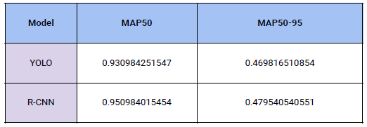

# 🛰️ UAV Object Detection – YOLOv11 vs. Faster R-CNN

## 🚀 Outcomes

- ✅ **YOLOv11** achieved **mAP50: 0.93** with very fast inference speed  
- ✅ **Faster R-CNN** achieved **mAP50: 0.95**, suitable for high-accuracy tasks  
- ✅ Trained, evaluated, and compared models on custom drone dataset  
- ✅ Applied modern techniques for annotation, augmentation, and performance analysis  
- ✅ Gained real-world experience with aerial vision data and object detection pipelines

---

## 📄 Project Overview

This project compares two deep learning models for object detection on a UAV (drone) image dataset. The goal is to evaluate the trade-off between **real-time speed** and **detection accuracy** using YOLOv11 and Faster R-CNN.

---

## 🏗️ Technical Architecture

- **Dataset:** 314 annotated UAV images
- **Splits:** Training, validation, and test sets
- **YOLOv11:** Implemented using Ultralytics; trained with hyperparameter tuning
- **Faster R-CNN:** Built using PyTorch; evaluated with COCO metrics
- **Metrics:** mAP@0.50, mAP@.50:.95, PR Curves

---

## 🧰 Tools & Stack

- Python  
- Ultralytics YOLOv11  
- PyTorch (Faster R-CNN)  
- LabelImg (annotation)  
- OpenCV, Albumentations  
- Matplotlib, Seaborn

---

## 🖼️ Screenshots or Visuals

### 📸 YOLOv11 Detection Example  
  
> YOLOv11 detected multiple objects quickly and with reasonable accuracy, suitable for real-time tasks.

---

### 📸 Faster R-CNN Detection Example  
  
> Faster R-CNN identified objects more precisely, especially smaller ones, at the cost of slower inference.

---

### 📊 YOLOv11 mAP Curve  
  
> YOLOv11 achieved a maximum **mAP50 of 0.93**, ideal for lightweight inference.

---

### 📊 Faster R-CNN mAP Curve  
  
> Faster R-CNN reached a higher **mAP50 of 0.95**, making it suitable for high-precision detection tasks.

---

### 📈 Precision-Recall Curve – YOLOv11  
  
> Shows YOLOv11’s balance between precision and recall across detection thresholds.

---

### 📊 YOLOv11 vs Faster R-CNN – mAP Comparison  
  
> Side-by-side bar chart comparing model accuracy across metrics (mAP50, mAP@[.50:.95]).

---

## 🔍 Additional Notes

- mAP values were calculated using COCO evaluation logic  
- YOLO performed better in real-time inference  
- Faster R-CNN was more stable in small-object detection

---

