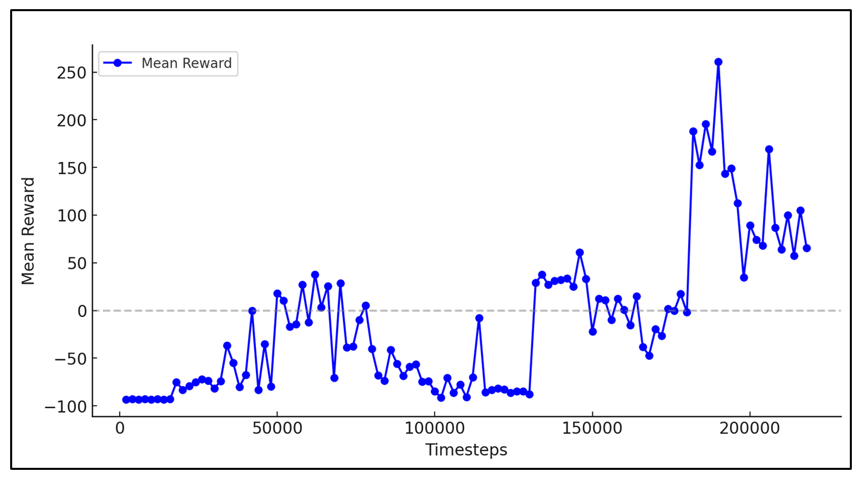
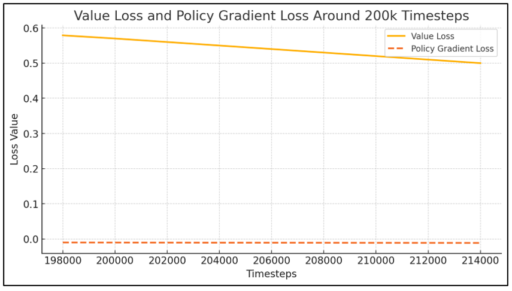
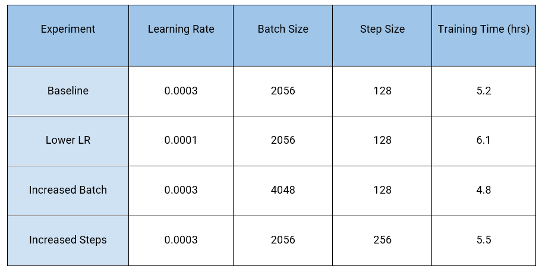

# 🧠 Deep Reinforcement Learning – Autonomous Driving with PPO

## 📄 Project Overview

This project applies **Deep Reinforcement Learning (DRL)** to teach an agent how to drive a car around a racetrack autonomously using Proximal Policy Optimization (PPO). The agent learns from raw visual input (grayscale frames) and receives rewards based on driving efficiency.

---

## 🏗️ Technical Architecture

- **Environment:** `CarRacing-v3` from OpenAI Gymnasium  
- **State:** Stacked grayscale frames (4x84x84)  
- **Action Space:** Continuous – steering, acceleration, braking  
- **Reward Shaping:** Penalized erratic driving and off-track behavior  
- **Model:** CNN-based Actor-Critic (PPO)  
- **Training Tool:** Stable Baselines3 with EvalCallback & TensorBoard  
- **Evaluation:** Average reward per episode, entropy, policy loss, value loss  

---

## 🧰 Tools & Stack

- Python  
- Stable Baselines3 (PPO)  
- Gymnasium (`CarRacing-v3`)  
- TensorBoard  
- OpenCV  
- Matplotlib

---

## 🖼️ Screenshots or Visuals

### 🕹️ Agent View – Frame Sample  
  
> Processed grayscale frame captured during PPO training from the CarRacing-v3 environment.

---

### 📈 Average Episode Reward Over Time  
  
> Reward increased steadily across training. Final agent averaged over **750** reward per episode.

---

### 📉 PPO Loss Curves – Value, Policy, Entropy  
  
> Tracks the evolution of value loss, policy loss, and entropy — used to tune learning behavior.

---

### 🧪 Model Comparison (Optional)  
  
> Summary of PPO model’s performance compared to other approaches (if relevant).

---

## 🔍 Additional Notes

- Reward shaping was key to training stability  
- Domain randomization improved robustness across different track layouts  
- Ablation testing showed smaller batch sizes led to better exploration early on

---

## 🚀 Outcomes

- ✅ Trained an agent using PPO to drive autonomously in the `CarRacing-v3` environment  
- ✅ Achieved **average reward ~750+** after tuning entropy, learning rate, and episode steps  
- ✅ Successfully shaped reward to discourage zig-zag movement and off-road driving  
- ✅ Implemented custom CNN-based policy/value networks  
- ✅ Used evaluation callbacks and TensorBoard for monitoring model performance  

